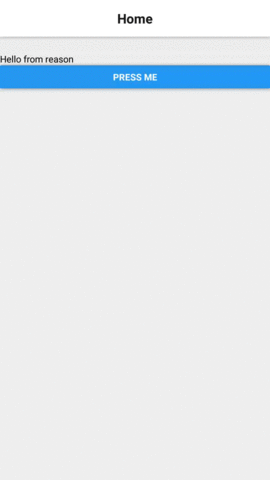

# Reason react native navigation example

This is a simple example implementation using [reason-react-native-navigation](https://github.com/szymonzmyslony/reason-react-native-navigation).

It has 2 screens and the first screen will push the second on to the stack and the other will pop itself when pressing the button. This is a more fleshed out example than in the readme for the project. This is how it looks:

I will try to keep this updated with future changes in reason-react-native-navigation.

---

This project was bootstrapped with [Create React Native App](https://github.com/react-community/create-react-native-app).
